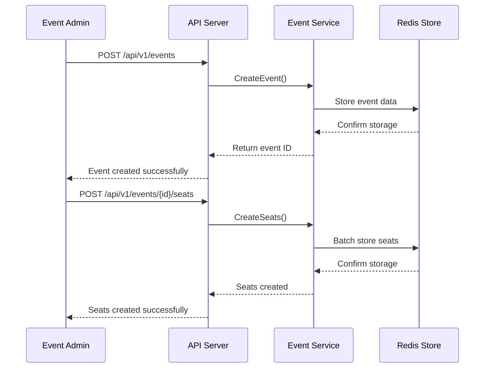
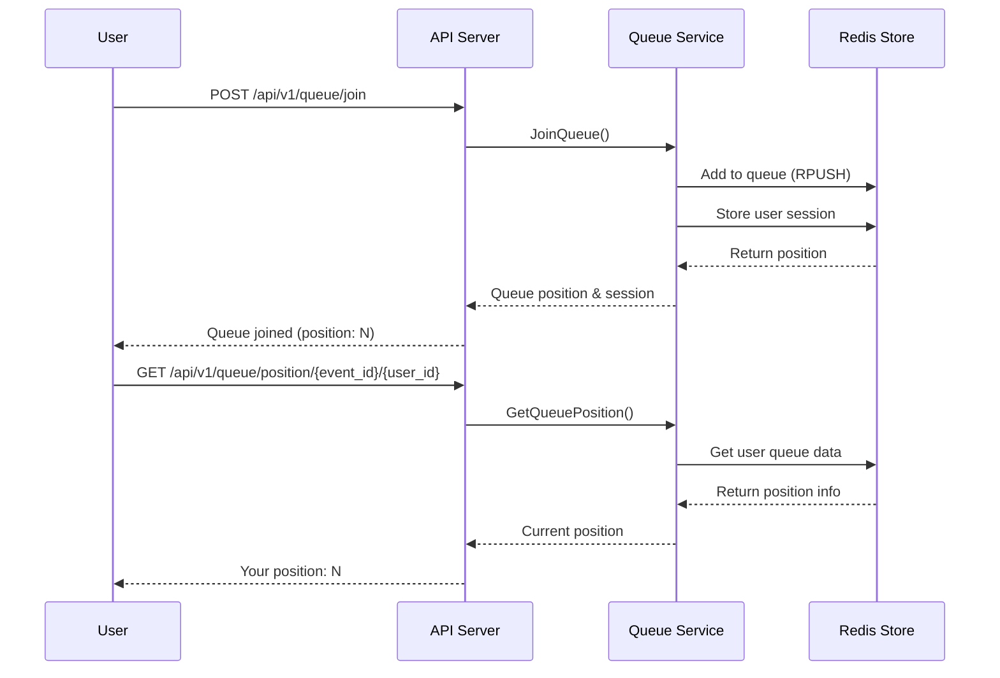
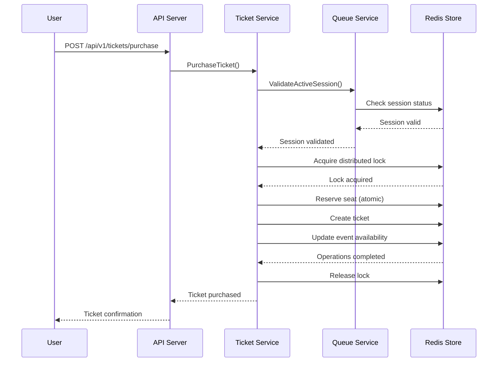

# Ticketing Service

A Redis-based distributed ticketing service built with Go, featuring event management, user queuing, and seat reservation capabilities.

## Features

- **Redis-based Distributed Cache**: High-performance caching and data storage
- **Event Management**: Create, update, and manage ticketing events
- **Seat Management**: Support for both seated and standing events
- **User Queue System**: Fair queuing system for high-demand events
- **Ticket Purchasing**: Secure ticket purchasing with reservation system
- **Distributed Locking**: Prevents race conditions in high-concurrency scenarios

## Architecture

This project follows a clean architecture pattern with strict separation of concerns:

- **Domain Layer** (`lib/domain`): Core business entities and rules
- **Repository Layer** (`lib/repository`): Data access interfaces
- **Adapter Layer** (`lib/adapter`): External service interfaces
- **Service Layer** (`internal/service`): Business logic implementation
- **Controller Layer** (`internal/controller`): HTTP request handling
- **Infrastructure Layer** (`pkg/`): Concrete implementations

### System Components

```
┌─────────────────┐    ┌─────────────────┐    ┌─────────────────┐
│   HTTP Client   │    │   HTTP Client   │    │   HTTP Client   │
│   (User 1)      │    │   (User 2)      │    │   (User N)      │
└─────────┬───────┘    └─────────┬───────┘    └─────────┬───────┘
          │                      │                      │
          └──────────────────────┼──────────────────────┘
                                 │
                    ┌─────────────▼─────────────┐
                    │      HTTP Router         │
                    │    (Gorilla Mux)         │
                    └─────────────┬─────────────┘
                                 │
                    ┌─────────────▼─────────────┐
                    │     Controllers          │
                    │ • Event Controller       │
                    │ • Queue Controller       │
                    │ • Ticketing Controller   │
                    └─────────────┬─────────────┘
                                 │
                    ┌─────────────▼─────────────┐
                    │      Services            │
                    │ • Event Service          │
                    │ • Queue Service          │
                    │ • Ticketing Service      │
                    └─────────────┬─────────────┘
                                 │
               ┌─────────────────┼─────────────────┐
               │                 │                 │
    ┌──────────▼──────────┐ ┌────▼────┐ ┌─────────▼─────────┐
    │   Redis Client      │ │  Cache  │ │  Distributed Lock │
    │   (Repositories)    │ │ Adapter │ │     Adapter       │
    └──────────┬──────────┘ └────┬────┘ └─────────┬─────────┘
               │                 │                 │
               └─────────────────┼─────────────────┘
                                 │
                    ┌─────────────▼─────────────┐
                    │      Redis Server        │
                    │   (Data & Cache Store)   │
                    └──────────────────────────┘
```

### Data Flow Architecture

```
┌─────────────────┐
│   Domain Layer  │  ← Core business entities (Event, Seat, Ticket, Queue)
│   (lib/domain)  │
└─────────────────┘
         ▲
         │ depends on
         │
┌─────────────────┐
│ Repository Layer│  ← Data access interfaces
│(lib/repository) │
└─────────────────┘
         ▲
         │ implements
         │
┌─────────────────┐
│ Infrastructure  │  ← Redis implementations
│ Layer (pkg/)    │
└─────────────────┘
         ▲
         │ uses
         │
┌─────────────────┐
│ Service Layer   │  ← Business logic orchestration
│(internal/service)│
└─────────────────┘
         ▲
         │ uses
         │
┌─────────────────┐
│Controller Layer │  ← HTTP request handling
│(internal/controller)│
└─────────────────┘
```

## How It Works

### 1. Event Management Flow



### 2. Queue Management Flow



### 3. Ticket Purchasing Flow



### 4. Distributed Locking Mechanism

The system uses Redis-based distributed locks to prevent race conditions:

- **Seat Reservation**: Ensures only one user can reserve a specific seat
- **Ticket Purchasing**: Prevents overselling of tickets
- **Queue Processing**: Manages concurrent queue operations

### 5. Redis Data Structure

```
Redis Keys Structure:
├── events:{event_id}                    # Event data (JSON)
├── seats:{event_id}                     # Seat data (Hash)
├── tickets:{ticket_id}                  # Ticket data (JSON)
├── queue:{event_id}                     # Queue list (List)
├── queue_entry:{event_id}:{user_id}     # Queue entry data (JSON)
├── session:{session_id}                 # Session data (Hash)
├── lock:{resource}                      # Distributed locks (String)
└── cache:{key}                          # General cache (String/JSON)
```

### 6. Session Management

- **Session Creation**: When user joins queue, a unique session ID is generated
- **Session Validation**: Required for ticket purchasing operations
- **Session Expiration**: Active sessions expire after 15 minutes
- **Session Renewal**: Users can refresh their session to extend time

### 7. Error Handling & Resilience

- **Redis Connection Failures**: Graceful degradation with error responses
- **Distributed Lock Timeouts**: Automatic cleanup of expired locks
- **Queue Processing Failures**: Retry mechanisms for queue operations
- **Concurrent Access**: Atomic operations prevent data corruption

## Technologies Used

- **Go 1.24**: Programming language
- **Redis**: Distributed cache and data storage
- **Zerolog**: Structured logging
- **Gorilla Mux**: HTTP router and URL matcher
- **Docker**: Containerization

## Getting Started

### Prerequisites

- Go 1.24 or later
- Redis server
- Docker and Docker Compose (optional)

### Running with Docker Compose

1. Clone the repository:
   ```bash
   git clone https://github.com/snowmerak/ticketing.git
   cd ticketing
   ```

2. Start the services:
   ```bash
   docker-compose up -d
   ```

3. The API will be available at `http://localhost:8080`

### Running Locally

1. Install dependencies:
   ```bash
   go mod tidy
   ```

2. Start Redis server:
   ```bash
   redis-server
   ```

3. Run the application:
   ```bash
   go run cmd/ticketing-server/app.go
   ```

## API Endpoints

### Events

- `POST /api/v1/events` - Create a new event
- `GET /api/v1/events/active` - Get all active events
- `GET /api/v1/events/{id}` - Get event by ID
- `PUT /api/v1/events/{id}` - Update event
- `DELETE /api/v1/events/{id}` - Delete event
- `POST /api/v1/events/{id}/seats` - Create seats for event
- `GET /api/v1/events/{id}/seats/available` - Get available seats

### Queue

- `POST /api/v1/queue/join` - Join event queue
- `GET /api/v1/queue/position/{event_id}/{user_id}` - Get queue position
- `GET /api/v1/queue/status/{session_id}` - Get queue status by session
- `GET /api/v1/queue/length/{event_id}` - Get queue length
- `POST /api/v1/queue/process/{event_id}` - Process queue (activate next user)
- `POST /api/v1/queue/refresh` - Refresh session

### Tickets

- `POST /api/v1/tickets/purchase` - Purchase ticket
- `POST /api/v1/tickets/{id}/confirm` - Confirm ticket
- `POST /api/v1/tickets/{id}/cancel` - Cancel ticket
- `GET /api/v1/tickets/{id}` - Get ticket by ID
- `GET /api/v1/tickets/user/{user_id}` - Get user's tickets

### Health Check

- `GET /health` - Health check endpoint

## Example Usage

### Creating an Event

```bash
curl -X POST http://localhost:8080/api/v1/events \
  -H "Content-Type: application/json" \
  -d '{
    "name": "Concert 2024",
    "description": "Amazing live concert",
    "start_time": "2024-12-25T20:00:00Z",
    "end_time": "2024-12-25T23:00:00Z",
    "venue": "Main Arena",
    "total_tickets": 1000,
    "is_seated_event": true
  }'
```

### Joining Queue

```bash
curl -X POST http://localhost:8080/api/v1/queue/join \
  -H "Content-Type: application/json" \
  -d '{
    "event_id": "event-uuid",
    "user_id": "user-uuid",
    "session_id": "session-123"
  }'
```

### Purchasing Ticket

```bash
curl -X POST http://localhost:8080/api/v1/tickets/purchase \
  -H "Content-Type: application/json" \
  -d '{
    "event_id": "event-uuid",
    "user_id": "user-uuid",
    "seat_id": "seat-uuid",
    "session_id": "session-123"
  }'
```

## Configuration

The application can be configured using environment variables:

- `REDIS_ADDR`: Redis server address (default: localhost:6379)
- `REDIS_PASSWORD`: Redis password (default: empty)
- `REDIS_DB`: Redis database number (default: 0)

## Development

### Project Structure

```
.
├── cmd/
│   └── ticketing-server/     # Application entry point
├── internal/
│   ├── controller/           # HTTP handlers
│   └── service/              # Business logic
├── lib/
│   ├── adapter/              # External service interfaces
│   ├── domain/               # Core entities
│   └── repository/           # Data access interfaces
├── pkg/
│   ├── client/               # External client implementations
│   ├── logger/               # Logging implementation
│   └── repository/           # Repository implementations
└── docs/
    └── project_structure.md  # Architecture documentation
```

### Running Tests

```bash
go test ./...
```

### Building

```bash
go build -o ticketing-server cmd/ticketing-server/app.go
```

## Contributing

1. Fork the repository
2. Create a feature branch
3. Make your changes
4. Add tests
5. Submit a pull request

## License

This project is licensed under the MIT License - see the [LICENSE](LICENSE) file for details.
A simple ticketing service
