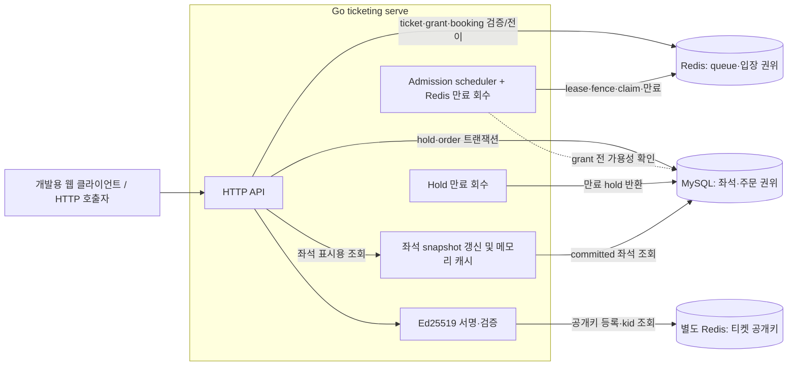

# Ticketing V1 아키텍처 (현재 구현)

> 상태: 로컬 개발·검증용 V1의 as-built 설명, 운영 HA 설계 또는 배포 보증 아님
>
> 대상: 구현자, 리뷰어, 운영 설계 담당자
>
> 기준: `main`의 Go 서비스·Redis Lua·MySQL migration, 2026-09-24
>
> 갱신 시점: 구성 요소의 책임, 권위 있는 데이터, 요청 흐름 또는 장애 동작이 바뀔 때

이 문서는 컴포넌트 사이의 관계와 장애 경계를 설명한다. 제품 목표와 향후 범위는 [blueprint](./blueprint.md), 키 설계 결정은 [ADR 0001](./adr/0001-ephemeral-ticket-signing-keys.md), 정확한 HTTP 형식은 [API 계약](./API.md), 실제 route/status는 [HTTP 서버](../internal/httpapi/server.go), 테이블 제약은 [migration](../migrations/001_init.sql), 측정·검증 증거는 [보고서](./reports/TEST-REPORT.md)가 소유한다. 문서와 코드가 다르면 코드를 확인한다.

## 실행 구성과 책임

`ticketing serve`는 하나의 Go 프로세스 안에서 HTTP API와 세 가지 백그라운드 작업을 함께 실행한다. 로컬 [Compose](../compose.yaml)는 대기열 Redis, 별도 티켓 공개키 Redis, MySQL을 실행하며 Go 서비스는 [README](../README.md)의 명령으로 별도 시작한다. 현재 Compose에는 로드밸런서, Redis/MySQL 복제본, 실제 결제 시스템이 없다.

| 구성 요소 | 현재 책임 | 코드 |
|---|---|---|
| HTTP API | 개발용 subject 수신, ticket/permit 검증, hold·confirm 진입점, health·request count | [server.go](../internal/httpapi/server.go) |
| Redis queue store + Lua | 이벤트별 epoch, sequence, READY, capacity/rate, grant, booking permit의 원자 전이 | [store.go](../internal/queue/store.go), [Lua](../redis/lua) |
| 티켓 서명기 + 키 Redis 어댑터 | 인스턴스 메모리 개인키로 Ed25519 서명, 공개키 등록·조회, `kid` 검증·회전 | [signer.go](../internal/ticket/signer.go), [registry.go](../internal/keyredis/registry.go) |
| Admission worker | MySQL 가용성 확인, 이벤트별 lease/fence 획득, READY 후보 claim, grant/booking 회수·통계 갱신 | [worker.go](../internal/queue/worker.go) |
| MySQL booking store | 좌석 잠금, hold·취소·확정, 사용자별 구매 제약, 만료 처리 | [store.go](../internal/booking/store.go) |
| Seat cache | MySQL 재고의 약 1초 주기 메모리 snapshot; 최종 판매 판정에는 사용하지 않음 | [cache.go](../internal/booking/cache.go) |

## 데이터 권위와 불변식

Redis와 MySQL 사이에 분산 트랜잭션은 없다. Redis에서 입장 권한을 얻었다고 좌석을 소유하는 것은 아니며, MySQL의 확정 주문이 판매 결과다.

| 상태 | 권위/지속 경계 | 파생·재생성 가능한 상태 |
|---|---|---|
| 대기 순번, 활성 epoch, READY·spent·reserved, grant, booking permit, capacity/rate | 대기열 Redis의 이벤트별 control/meta와 원자 Lua 전이. ticket은 Ed25519 서명되지만 클라이언트 토큰만으로 spent·grant·permit 상태를 복원하지 못함 | READY 기반 `estimated_ahead` 통계는 표시용 추정치 |
| 대기표 공개 검증키 | 별도 키 Redis에 `kid`(공개키 해시)로 등록, TTL까지 조회 가능. 개인키는 해당 발급 인스턴스의 메모리에만 존재 | 새 인스턴스의 새 키쌍. 이전 공개키가 사라지면 기존 대기표 검증 불가 |
| 좌석 정의·재고, hold·주문, 이벤트별 구매 여부 | MySQL/InnoDB transaction commit, PK/UNIQUE 제약과 purchase guard | 프로세스 메모리의 좌석 snapshot; 최대 3초를 넘으면 `is_stale`로 표시 |

핵심 규칙은 다음 두 가지다.

1. 같은 `(event_id, subject_id)`에는 확정 구매가 최대 한 건, 주문 좌석이 최대 한 석이다. MySQL의 `event_purchase_guards` 행 잠금과 `orders`의 UNIQUE 제약이 서로 다른 ticket·booking·hold에서 동시에 confirm하더라도 이 규칙을 강제한다. 2석 이상 hold 요청도 DB 변경 전에 거절한다.
2. 같은 사용자는 여러 대기표를 받을 수 있고 구매 뒤에도 새 대기표를 받을 수 있다. 새 발급은 구매 이력에 묶이지 않으며 각각 고유 `ticket_id`와 epoch 내 `seq`를 갖는다. 새 대기표나 새 booking permit이 추가 구매권을 주지는 않는다.

좌석의 식별자는 `(event_id, seat_id)`이며 화면 alias나 숫자 간격이 소유권·연석 여부를 정하지 않는다. 화면의 `AVAILABLE`도 snapshot이므로 선점 가능성의 최종 판정이 아니다.

## 입장부터 구매까지

1. `entry`는 MySQL에 ping하여 직접 입장 가능 여부를 정하고, Redis Lua에서 capacity와 token bucket을 원자적으로 검사한다. 여유가 있으면 queue epoch 없이 `DIRECT` booking permit을 만든다. 여유가 없거나 MySQL이 불가하면 `QUEUE` ticket을 발급한다. 활성 queue가 있으면 신규 요청이 빈 capacity를 이유로 앞선 대기열을 우회하지 않는다.
2. 클라이언트는 서명 ticket으로 heartbeat를 보낸다. 서명기는 별도 키 Redis에서 `kid`로 공개키를 찾아 서명·subject·event·epoch·만료를 검증하고, 대기열 Redis는 서버 상태를 확인한 뒤 시간 슬롯/페이지 READY bitmap에 응답 의사를 기록한다. 잠시 READY에서 빠져도 ticket 유효기간 내 같은 `seq`로 돌아올 수 있다. `estimated_ahead`는 판정에 쓰지 않는다.
3. scheduler는 최근 READY에서 spent/reserved를 뺀 후보를 조사하고, 현재 lease/fencing token, capacity, admission rate를 Lua claim에서 다시 검사해 grant를 예약한다. grant를 redeem하면 같은 요청의 재시도에 같은 booking permit이 돌아온다. grant 미교환·booking 만료와 명시적 leave는 capacity를 중복 반환하지 않도록 Redis 전이로 처리한다.
4. 좌석 맵 요청에는 유효한 booking permit이 필요하다. API는 메모리 snapshot을 반환하되, 캐시가 아직 없으면 MySQL에서 직접 조회한다. 조회 실패/오래된 값은 새로운 좌석 소유권을 만들지 않는다.
5. hold 생성은 permit을 Redis에서 확인한 뒤 MySQL `READ COMMITTED` 트랜잭션을 시작한다. `(event, subject)` purchase guard를 잠그고 기존 idempotency key를 확인한다. 지정 좌석은 `FOR UPDATE NOWAIT`, 한 석 자동배정은 `FOR UPDATE SKIP LOCKED`로 선택한 뒤 `AVAILABLE → HELD`를 commit한다. 이미 잠겼거나 팔린 좌석은 명시적 충돌로 반환한다.
6. confirm은 동일 guard·hold·seat 소유권과 DB 시각의 만료를 다시 검사하고 `HELD → SOLD`, 주문·주문 항목, guard의 `order_id`를 한 트랜잭션에서 commit한다. 결제는 실제 PG 호출이 아닌 개발용 `payment_result_id` 입력이다. 취소/만료는 현재 hold 소유 좌석만 `AVAILABLE`로 되돌린다.

## 시작·장애·복구 경계

`migrate`는 MySQL schema/seed를 적용하고, `init-state`는 대기열 Redis installation marker와 이벤트 control을 명시적으로 초기화한다. 일반 `serve`는 이를 자동 생성하지 않으며, 인스턴스의 Ed25519 공개키를 별도 키 Redis에 등록한 뒤 대기열 Redis marker/control·키 조회·MySQL 접속을 확인하고 시작한다. `/livez`는 프로세스 응답, `/readyz`는 대기열 Redis ping·installation 상태·현재 공개키 조회·MySQL ping을 확인한다. `/readyz`가 과거 공개키 전체의 보존, 좌석 캐시의 최신성이나 scheduler lease 보유까지 보증하지는 않는다. 종료 시 HTTP server를 제한 시간 안에 shutdown하고 백그라운드 작업을 취소한다.

| 장애 | 현재 동작과 한계 |
|---|---|
| MySQL 불가 | 신규 direct permit 대신 queue ticket을 발급하고 scheduler가 grant를 멈춘다. 좌석 변경은 실패한다. MySQL 복구 후 worker가 다시 진행할 수 있으나 자동 failover는 구현하지 않았다. |
| Redis 접속 불가 또는 권위 상태 유실 의심 | ticket/permit 판정과 새 입장을 안전하게 진행할 수 없다. API는 오류를 반환하고 핵심 control/epoch 불일치 시 `RECOVERING`으로 닫는다. 빈 정상 상태로 자동 재초기화하지 않는다. |
| 키 Redis 접속 불가 또는 공개키 유실 | 대기표 발급·검증과 readiness가 실패한다. 기존 공개키가 유실되면 해당 미만료 대기표도 검증할 수 없다. 단순 프로세스 재시작은 키 Redis의 과거 공개키를 지우지 않는다. |
| scheduler 또는 만료 작업 중단 | 새 grant나 반환이 지연돼 처리량이 줄 수 있다. 이미 Redis/MySQL에 기록된 권한·주문은 프로세스 메모리에만 있지 않으며, 재시작 작업이 남은 상태를 다시 조사한다. |
| 좌석 캐시 지연 | 오래된 snapshot을 표시할 수 있지만 hold·판매 권위는 MySQL에 남는다. |

로컬 구성에서는 **두 Redis와 MySQL이 각각 단일 컨테이너이므로 장애점**이다. 여러 Go API 프로세스가 같은 대기열 Redis와 키 Redis를 공유하는 형태는 서명·lease/fencing을 고려해 구현됐지만, 장시간 다중 프로세스·failover 검증은 아직 없다. Redis를 같은 이벤트에 대해 단순 멀티마스터로 쓰는 구성은 현재 아키텍처가 아니다. Redis replica/AOF(`everysec`)도 승인된 권한 상태나 공개키의 failover 무손실을 보장하지 않는다. MySQL read replica를 추가해도 주문 쓰기의 primary 가용성 문제는 별도로 남는다. 따라서 “MySQL이 유일한 SPOF”는 이 로컬 구현의 사실이 아니다.

## 신뢰·관측·검증 범위

- `X-Subject-ID`는 **개발용 식별자 입력**이지 인증이 아니다. 토큰 Ed25519 서명·subject 묶음은 임의 사용자가 다른 subject를 주장하는 문제를 해결하지 못한다. 키 Redis에 임의 공개키를 등록할 권한을 가진 주체는 토큰을 위조할 수 있으므로 그 쓰기 접근을 인프라에서 제한해야 한다. 실제 결제와 TLS 종료, abuse 제어도 이 저장소의 V1에 없다. `/debug/events/{event}`와 개발용 confirm을 인터넷에 노출해서는 안 된다.
- 요청 로그는 route·status·duration·request ID를 기록하고 `/metrics`는 프로세스 메모리의 route/status class별 요청 수를 반환한다. 현재 분산 tracing, Redis/MySQL 상세 지연 및 지속 메트릭 저장소는 없다.
- [E2E 테스트](../e2e/journey_test.go)는 실제 프로세스 재시작을 포함한 대기→grant/redeem→단일 좌석 구매와 구매 후 새 대기표를 검증했다. [테스트 보고서](./reports/TEST-REPORT.md)와 [벤치마크 보고서](./reports/BENCHMARK-REPORT.md)는 통과·미실행 범위와 로컬 성능 관찰을 구분한다. Redis/MySQL 프로세스 장애 주입, 실제 PG, 자동 failover, 운영 규모 지속 부하는 아직 검증되지 않았다.
